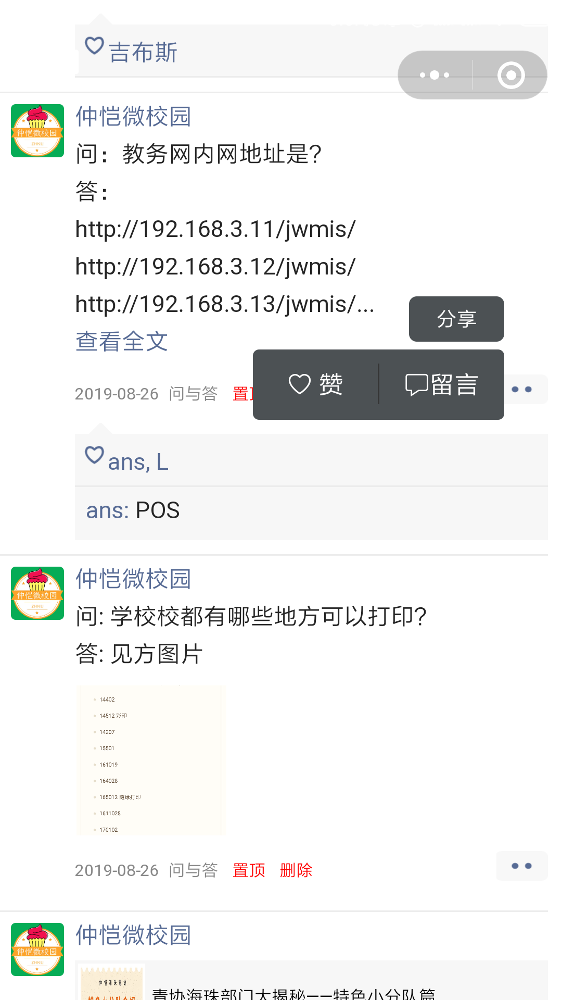

# 仿微信朋友圈

## 后端基于微信云开发

## 实现功能
- [X] 发布"朋友圈"
- [X] 信息标签管理
- [X] 管理员端置顶、删除
- [X] 文字内容安全检测 //云开发api
- [X] 解析公众号文章链接 //wxparse

## 本地运行

1. `git clone https://github.com/chenaey/circle-_of_-friend_demo.git `
2. 在微信开发者工具中打开项目文件
3. 开通云开发
4. 将appid填写为你的appid
5. 手动建立如下数据库集合
`circle` 
`circleback` //数据备份
6. 在云开发存储创建存储用户上传图片文件夹 `circle`
7. 上传并部署云函数,选择云端安装依赖或者本地安装`npm install`
8. 大功告成

## 页面截图
</img>
</img>
</img>

